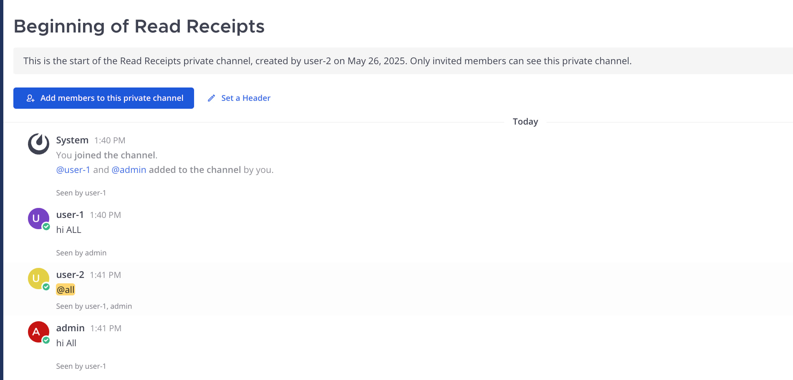
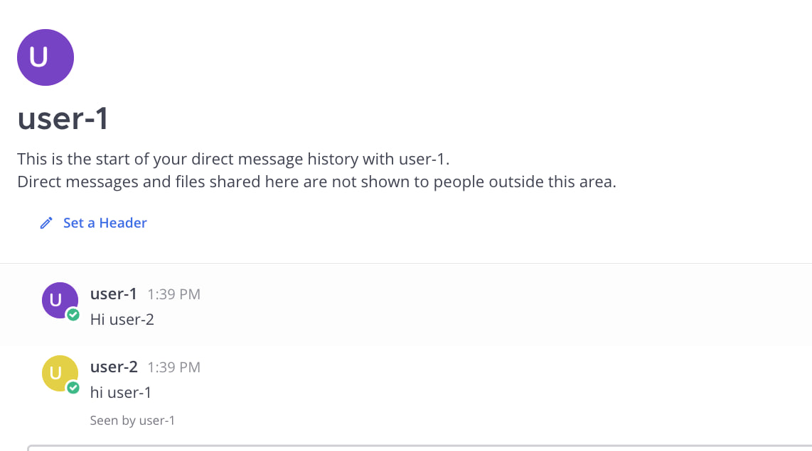
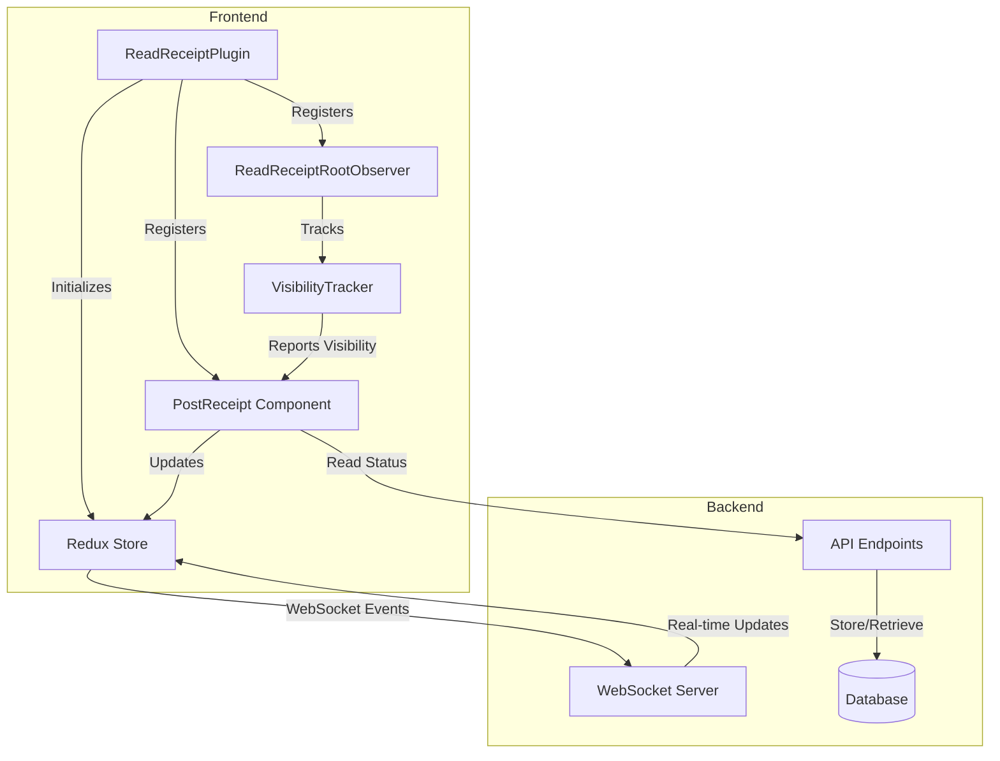

# Mattermost Read Receipts Plugin

WhatsApp / Telegram style "Seen by ..." indicators for every post in Mattermost. Get real-time visibility into who has read messages in your channels.

<p align="center">
  
  
</p>

## Architecture and Flow

### Component Overview



### Message Read Flow

```mermaid
sequenceDiagram
    participant U as User
    participant VT as VisibilityTracker
    participant C as Client Store
    participant WS as WebSocket
    participant S as Server
    participant DB as Database
    
    U->>VT: Views message
    VT->>VT: Wait 2000ms
    VT->>C: Mark as read
    C->>WS: Send read event
    WS->>S: Forward event
    S->>DB: Store receipt
    S->>WS: Broadcast to channel
    WS->>C: Update UI
```Read Receipts Plugin


## Download

[⬇️ Download pre-built plugin](https://github.com/ghaffaria/Mattermost-Read-Receipts/releases/download/v0.1.2/mattermost-readreceipts-2025.05.26.1827.tar.gz)


WhatsApp / Telegram style “Seen by …” indicators for every post in Mattermost.

<p align="center">
  <!-- replace with real images or delete -->
  
  
</p>

---

## Core Components

### Frontend Components

1. **ReadReceiptPlugin** (`webapp/plugin.tsx`)
   - Entry point for the plugin
   - Initializes Redux store
   - Registers WebSocket handlers
   - Sets up UI components

2. **ReadReceiptRootObserver** (`webapp/components/ReadReceiptRootObserver.tsx`)
   - Manages visibility tracking
   - Coordinates with VisibilityTracker

3. **PostReceipt** (`webapp/components/PostReceipt.tsx`)
   - Renders "Seen by..." indicators
   - Handles real-time updates

4. **VisibilityTracker** (`webapp/components/VisibilityTracker.tsx`)
   - Uses Intersection Observer API
   - Tracks message visibility
   - Triggers read events

### Backend Components

1. **Plugin Server** (`server/plugin.go`)
   - Main plugin implementation
   - Handles initialization
   - Manages database connections

2. **API Handler** (`server/api.go`)
   - REST endpoints implementation
   - WebSocket event handling
   - Authentication middleware

3. **Store Layer** (`server/store/`)
   - Database interactions
   - Supports MySQL and PostgreSQL
   - Handles migrations

## Features

| Feature | Implementation Details |
|---------|----------------------|
| **Real-time tracking** | Uses Intersection Observer + WebSockets |
| **Accurate reading** | 2-second visibility threshold |
| **Persistent storage** | Shared database with Mattermost |
| **Resilient** | Handles deleted posts gracefully |
| **Two-level tracking** | Per-post and per-channel status |
| **Modern UI** | WhatsApp-style inline badges |
| **Admin tools** | Debug endpoints and structured logs |
| **Maintenance** | Automatic database cleanup |

---

## Compatibility
| Component | Tested version(s) |
|-----------|------------------|
| Mattermost Server | **≥ v6.0** (Team or Enterprise) |
| PostgreSQL        | 13.x |
| MySQL / MariaDB   | 8.0 / 10.6 |

> ⚠️ **No fallback DSN.**  
> The plugin **re-uses** the connection string configured under  
> *System Console → Environment → Database*.  
> If that field is still masked (`***********`) the plugin cannot connect and will refuse to start.
>
> 📝 **MySQL Configuration Note:**  
> If your MySQL DSN includes `?multiStatements=true`, this option is only required 
> for legacy multi-statement cleanup operations. With the current implementation, 
> this option can be safely removed from your DSN.

---

## Quick installation

1. **Download** the latest release (`mattermost-readreceipts-<date>.tar.gz`).  
2. **System Console → Plugins → Plugin Management**  
   * Upload → Enable.  
3. Done – receipts appear next to new messages.

---

## Building from source

```bash
git clone https://github.com/<you>/mattermost-readreceipts.git
cd mattermost-readreceipts

# build webapp + server + bundle
make dist            # → dist/<timestamp>.tar.gz
````

Upload the generated archive via System Console as usual.

### Development docker-compose (optional)

```bash
docker-compose up -d          # starts Mattermost + Postgres
export MM_SQLSETTINGS_DATASOURCE="postgres://mmuser:mostest@db:5432/mattermost?sslmode=disable"
make dev                       # live-reload plugin inside the container
```

---

## Configuration options (System Console → Plugins → Read Receipts)

| Key                           | Default | Description                                                |
| ----------------------------- | ------- | ---------------------------------------------------------- |
| **Enable Read Receipts**      | `true`  | Master switch                                              |
| **Visibility Threshold (ms)** | `2000`  | How long a post must be on-screen before it is marked read |
| **Receipt Retention (days)**  | `30`    | Older rows are purged nightly                              |
| **Log Level**                 | `info`  | `debug` for verbose output                                 |

---

## Troubleshooting

| Symptom                                          | Likely cause / fix                                                                                                    |
| ------------------------------------------------ | --------------------------------------------------------------------------------------------------------------------- |
| **`missing "=" after "********"` on activation** | The DB DSN is still masked. Paste the real DSN and click **Save** in System Console.                                  |
| Receipts never appear                            | Make sure both users run ≥ Mattermost v6 and have the plugin enabled. Check the browser console for WebSocket events. |
| Rows accumulate forever                          | Set **Retention (days)** to a non-zero value.                                                                         |
| Some read receipts not showing                   | If post is deleted, plugin falls back to showing channel-level read status                                            |

## API Endpoints

### Debug Endpoints (System Admin only)
* `GET …/plugins/mattermost-readreceipts/api/v1/debug/ping`
* `GET …/plugins/mattermost-readreceipts/api/v1/debug/db`

### Read Status Endpoints

* `GET …/plugins/mattermost-readreceipts/api/v1/receipts?channel_id={channelID}&since={timestamp}` - Get per-post read statuses for a channel. `since` (milliseconds) filter is required; use `0` to fetch all.
* `GET …/plugins/mattermost-readreceipts/api/v1/channel/{channelID}/readers` - Get channel-level read status (all users with any read receipt).
* `GET …/plugins/mattermost-readreceipts/api/v1/read/channel/{channelID}?since={timestamp}` - Get readers in a channel since a specific time (ms) or use `postID` parameter to base on a post’s timestamp.
* `POST …/plugins/mattermost-readreceipts/api/v1/read` - Mark a post as read; body must include `message_id` and optional `channel_id` (will auto-detect if omitted).

### WebSocket Events

* `custom_mattermost-readreceipts_read_receipt` - Emitted when a message is read. Payload: `{ message_id, user_id, channel_id, timestamp }`.
* `custom_mattermost-readreceipts_channel_readers` - Emitted on channel-level updates. Payload: `{ channel_id, last_post_id, user_ids }`.

All reader endpoints return a consistent JSON response with a `user_ids` array containing the IDs of users who have read the content.

---

## Database Schema

The plugin automatically creates and maintains the following tables on first run:

### channel_reads

Persists channel-level "Seen by ..." information, mapping users to their last seen message in each channel.

| Column | Type | Description |
|--------|------|-------------|
| channel_id | TEXT/VARCHAR | Mattermost channel identifier (part of PK) |
| user_id | TEXT/VARCHAR | User who has read messages (part of PK) |
| last_post_id | TEXT/VARCHAR | ID of the last post seen by this user |
| last_seen_at | BIGINT | Timestamp (milliseconds) when the user last saw this post |

Primary key: (channel_id, user_id)

Indexes:

* idx_channel_reads_channel_id
* idx_channel_reads_user_id

This table powers the real-time "Seen by ..." indicators in the UI and ensures they persist across server restarts. The plugin automatically creates and populates this table on first activation.

---

## Contributing

1. Fork, branch from **main**.
2. `make dev-setup` → `make test` → commit.
3. Open a pull-request – please include unit tests and README updates where relevant.

---

## License

[MIT](LICENSE)

---

### Acknowledgements

* Mattermost team for the plugin framework
* All contributors – PRs welcome!

