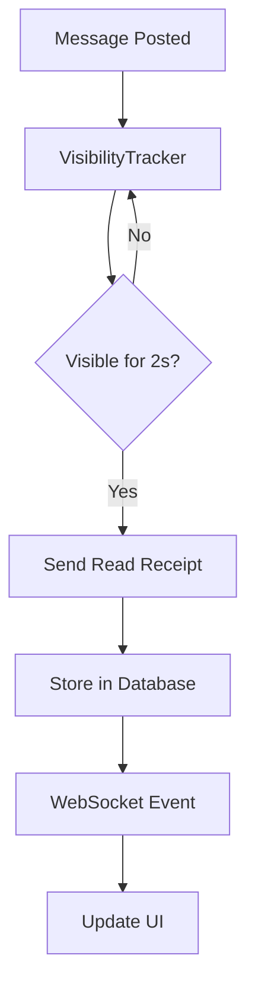
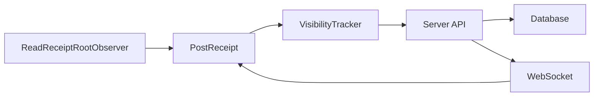

# Mattermost Read Receipts Plugin

This plugin adds WhatsApp/Telegram-style read receipts functionality to Mattermost, allowing users to see who has read their messages. It includes both server-side and webapp components with real-time visibility tracking.

## Overview

The plugin tracks message visibility in real-time using the Intersection Observer API, storing read receipts in a PostgreSQL database, and updating the UI via WebSocket events. When a message is visible for 2 seconds, it's marked as read.

### Component Architecture

First, let's look at the high-level data flow:



And here's how the components interact:



## Overview

The plugin tracks message visibility in real-time using the Intersection Observer API, storing read receipts in a PostgreSQL database, and updating the UI via WebSocket events. When a message is visible for 2 seconds, it's marked as read.

### Architecture Diagram


### Component Flow


## Key Features

* Real-time visibility tracking of messages using Intersection Observer API
* Precise read receipt detection with 2-second visibility threshold
* Persistent storage of read events in PostgreSQL database
* Real-time updates via WebSocket events
* WhatsApp-style read receipt UI next to messages
* Debug endpoints for troubleshooting and monitoring
* Configurable settings in System Console
* Comprehensive logging and error handling

## Prerequisites

- Mattermost server version 6.0 or higher.
- Node.js (v18 or higher) and npm installed.
- Go (v1.20 or higher) installed.

## Setup Instructions

### 1. Clone the Repository

```bash
git clone <repository-url>
cd Mattermost-Read-Receipts
```

### 2. Build the Server Plugin

1. Navigate to the root directory.

2. Run the following command to build the server plugin:

   ```bash
   make dist
   ```

3. The plugin bundle will be created in the `dist/` directory.

### 3. Build the Webapp

1. Navigate to the `webapp/` directory:

   ```bash
   cd webapp
   ```

2. Install dependencies:

   ```bash
   npm install
   ```

3. Build the webapp:

   ```bash
   npm run build
   ```

4. The webapp bundle will be created in the `webapp/dist/` directory.

### 4. Deploy the Plugin

1. Upload the server plugin bundle (`mattermost-readreceipts-<version>.tar.gz`) via the Mattermost System Console → Plugin Management.

2. Enable the plugin.

## Development

### Docker Development Environment

The plugin includes a Docker-based development environment that makes it easy to get started:

1. Make sure you have Docker and Docker Compose installed.

2. Start the development environment:

   ```bash
   docker-compose up -d
   ```

3. Access Mattermost at `http://localhost:8065`

The Docker environment includes:
- Mattermost Team Edition server
- PostgreSQL database
- Auto-loading of plugin changes
- Hot-reloading for webapp development

### Server Development

1. Run `go mod tidy` to ensure all dependencies are installed.

2. Use `go test ./...` to run the server tests.

3. Use `go vet ./...` to check for code issues.

4. The server includes debug endpoints for troubleshooting:
   - `/api/v1/debug/ping`: Check API connectivity
   - `/api/v1/debug/db`: Verify database connection and schema

### Webapp Development

1. Start the development server:

   ```bash
   npm run watch
   ```

2. The webapp will automatically rebuild on file changes.

3. Key components:
   - `VisibilityTracker`: Handles message visibility detection
   - `PostReceipt`: Manages read receipt UI
   - `ReadReceiptRootObserver`: Coordinates receipt tracking

## Configuration

### System Console Settings

- **Enable Read Receipts**: Toggle to enable or disable the read receipts feature.
- **Enable Logging**: Toggle to enable or disable logging for debugging purposes.

## File Structure

- `server/`: Contains the Go code for the server plugin.
- `webapp/`: Contains the React code for the webapp plugin.
- `Makefile`: Automates the build process.
- `README.md`: Documentation for the plugin.

## Debugging

### Frontend Debugging

The plugin includes comprehensive debug logging that can be viewed in the browser console:
- Visibility tracking events (👁️)
- API request/response logs (📤/📨)
- WebSocket events (🔌)
- Database operations (💾)

### Backend Debugging

1. View server logs in Docker:
   ```bash
   docker-compose logs -f app
   ```

2. Check database connectivity:
   ```bash
   curl http://localhost:8065/plugins/mattermost-readreceipts/api/v1/debug/db
   ```

3. Verify plugin activation:
   ```bash
   curl http://localhost:8065/plugins/mattermost-readreceipts/api/v1/debug/ping
   ```

## Troubleshooting

Common issues and solutions:

1. Read receipts not appearing
   - Check browser console for visibility tracking logs
   - Verify API requests are being sent
   - Check server logs for any errors
   - Verify database connectivity with debug endpoint

2. Database connection issues
   - Ensure PostgreSQL is running (`docker-compose ps`)
   - Check database logs (`docker-compose logs db`)
   - Verify schema exists using debug endpoint

3. Plugin not loading
   - Check System Console → Plugin Management
   - Verify plugin bundle is properly built
   - Check server logs for activation errors

## Security Considerations

1. **Authentication**
   - All API endpoints require Mattermost authentication
   - CSRF tokens are validated for all POST requests
   - User ID verification on both client and server

2. **Data Privacy**
   - Read receipts only visible to message participants
   - No historical data exposed through API
   - Database access restricted to plugin

3. **Rate Limiting**
   - Debounced visibility checks (100ms)
   - Throttled WebSocket broadcasts
   - Database write optimizations

## Performance Optimizations

1. **Client-Side**
   - Intersection Observer for efficient visibility tracking
   - Debounced visibility checks
   - Batched WebSocket updates
   - React component memoization

2. **Server-Side**
   - Database connection pooling
   - Indexed queries
   - Optimistic updates
   - WebSocket broadcast filtering

3. **Database**
   - Efficient schema design
   - UPSERT operations
   - Proper indexing
   - Regular cleanup of old receipts

## Best Practices

1. **Development**
   - Use TypeScript for type safety
   - Follow Mattermost plugin guidelines
   - Maintain comprehensive logging
   - Write unit tests

2. **Deployment**
   - Test in staging environment
   - Monitor performance metrics
   - Regular backups
   - Version control

3. **Maintenance**
   - Regular dependency updates
   - Performance monitoring
   - Log rotation
   - Database maintenance

## Contributing Guidelines

1. **Setup Development Environment**
   ```bash
   git clone <repository>
   cd Mattermost-Read-Receipts
   make dev-setup
   ```

2. **Run Tests**
   ```bash
   # Server tests
   go test ./...
   
   # Webapp tests
   cd webapp && npm test
   ```

3. **Submit Changes**
   - Fork the repository
   - Create a feature branch
   - Submit a pull request
   - Include tests and documentation

## License

This project is licensed under the MIT License. See the LICENSE file for details.

## Support

For issues and feature requests:
1. Check existing issues
2. Use debug endpoints
3. Include logs and reproduction steps
4. Create a detailed bug report

## Project Structure

```plaintext
Mattermost-Read-Receipts/
├── server/                 # Backend Go code
│   ├── api.go             # HTTP API endpoints
│   ├── plugin.go          # Plugin initialization
│   ├── model.go           # Data models
│   ├── config.go          # Configuration handling
│   └── db/
│       └── schema.go      # Database schema definitions
├── webapp/                 # Frontend React code
│   ├── components/
│   │   ├── VisibilityTracker.tsx      # Message visibility detection
│   │   ├── PostReceipt.tsx            # Read receipt UI
│   │   ├── ReadReceiptRootObserver.tsx # Message tracking coordinator
│   │   └── AdminSettings.tsx           # System console settings
│   ├── store.ts           # State management
│   ├── websocket.ts       # Real-time events
│   └── plugin.tsx         # Plugin entry point
└── docker-compose.yml     # Development environment
```

## Core Components

### Frontend Components

1. **VisibilityTracker**
   - Tracks message visibility using Intersection Observer API
   - Implements 2-second visibility threshold
   - Sends read receipts to server
   
   ```typescript
   interface VisibilityTrackerProps {
       messageId: string;  // Format: userId:timestamp
   }
   ```

2. **PostReceipt**
   - Manages read receipt UI for each message
   - Listens for WebSocket updates
   - Displays who has read the message
   
   ```typescript
   interface PostReceiptProps {
       post: {
           id: string;  // Message ID
       };
   }
   ```

3. **ReadReceiptRootObserver**
   - Coordinates receipt tracking across messages
   - Manages receipt container lifecycle
   - Initializes tracking for new messages

### Backend Components

1. **API Endpoints** (`api.go`)
   ```go
   POST /api/v1/read          // Store read receipt
   GET  /api/v1/receipts      // Get message receipts
   GET  /api/v1/debug/ping    // Health check
   GET  /api/v1/debug/db      // Database status
   ```

2. **Database Schema** (`schema.go`)
   ```sql
   CREATE TABLE IF NOT EXISTS read_events (
       message_id VARCHAR(255),
       user_id VARCHAR(255),
       timestamp BIGINT,
       PRIMARY KEY (message_id, user_id)
   );
   ```

3. **WebSocket Events**
   - `custom_mattermost-readreceipts_read_receipt`
   ```json
   {
       "message_id": "string",
       "user_id": "string",
       "timestamp": "number"
   }
   ```

## Data Flow

1. **Message Visibility Detection**
   ```mermaid
   sequenceDiagram
       VisibilityTracker->>IntersectionObserver: Start monitoring
       IntersectionObserver->>VisibilityTracker: Visibility change
       VisibilityTracker->>Timer: Start 2s timer
       Timer->>API: Send read receipt
       API->>Database: Store receipt
       API->>WebSocket: Broadcast event
       WebSocket->>PostReceipt: Update UI
   ```

2. **Read Receipt Storage**
   ```mermaid
   sequenceDiagram
       API->>Database: Check existing receipt
       Database-->>API: No receipt found
       API->>Database: Store new receipt
       API->>WebSocket: Broadcast update
       WebSocket-->>UI: Update read status
   ```

## Key Functions

### Frontend

1. **Visibility Tracking**
   ```typescript
   const checkVisibilityDuration = () => {
       if (visibilityStartTime.current && !hasSent) {
           const duration = Date.now() - visibilityStartTime.current;
           if (duration >= 2000) {
               sendReadReceipt();
           }
       }
   };
   ```

2. **Receipt Management**
   ```typescript
   const handleWebSocketEvent = (event: WebSocketEventData) => {
       if (event.data.message_id === messageId) {
           setSeenBy(prev => [...prev, event.data.user_id]);
       }
   };
   ```

### Backend

1. **Receipt Storage**
   ```go
   func (p *Plugin) storeReadEvent(event ReadEvent) error {
       query := `INSERT INTO read_events (message_id, user_id, timestamp) 
                VALUES ($1, $2, $3) 
                ON CONFLICT (message_id, user_id) 
                DO UPDATE SET timestamp = EXCLUDED.timestamp;`
       _, err := p.DB.Exec(query, event.MessageID, event.UserID, event.Timestamp)
       return err
   }
   ```

2. **WebSocket Broadcasting**
   ```go
   p.API.PublishWebSocketEvent(
       "custom_mattermost-readreceipts_read_receipt",
       map[string]interface{}{
           "message_id": event.MessageID,
           "user_id":    event.UserID,
           "timestamp":  event.Timestamp,
       },
       &model.WebsocketBroadcast{},
   )
   ```
