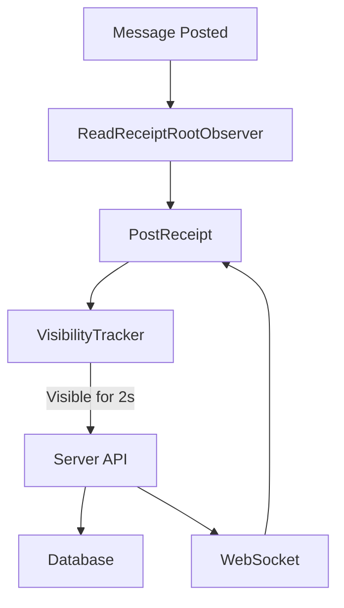
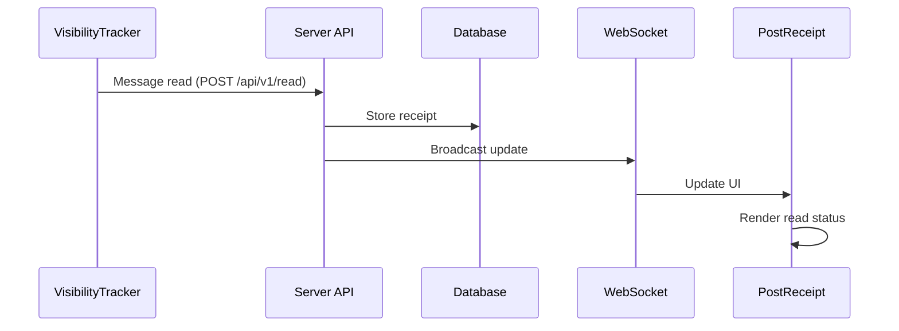
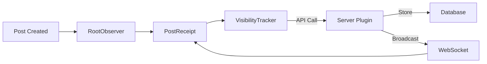

# Mattermost Read Receipts Plugin

This plugin adds WhatsApp/Telegram-style read receipts functionality to Mattermost, allowing users to see who has read their messages. It includes both server-side and webapp components with real-time visibility tracking.

## Features

- Real-time visibility tracking using Intersection Observer API
- Precise read receipt detection with 2-second visibility threshold
- Persistent storage of read events in PostgreSQL database
- Real-time updates via WebSocket events
- WhatsApp-style read receipt UI next to messages
- Debug endpoints for troubleshooting and monitoring
- Configurable settings in System Console
- Comprehensive logging and error handling

## Installation

### Using Pre-built Release

1. Download the latest release from the [releases page](https://github.com/YOUR_USERNAME/Mattermost-Read-Receipts/releases)
2. Go to System Console > Plugins > Plugin Management
3. Upload the plugin bundle (`.tar.gz` file)
4. Enable the plugin

### Development Setup

#### Prerequisites

- Mattermost Server (v6.0 or higher)
- Go v1.20 or higher (`go version` to check)
- Node.js v18 or higher (`node -v` to check)
- npm v9 or higher (`npm -v` to check)
- GNU Make

#### Build from Source

1. Clone the repository:

   ```bash
   git clone https://github.com/YOUR_USERNAME/Mattermost-Read-Receipts.git
   cd Mattermost-Read-Receipts
   ```

2. Install webapp dependencies:

   ```bash
   cd webapp
   npm install
   cd ..
   ```

3. Build the plugin:

   ```bash
   make dist
   ```

   This command will:
   - Clean output directories
   - Build the webapp (TypeScript/React)
   - Build server binaries for multiple architectures
   - Create the plugin bundle in `dist/`

4. Install the plugin:
   - Copy the generated `.tar.gz` file from `dist/`
   - Upload it to your Mattermost instance
   - Enable the plugin in System Console

## Development Workflow

1. Make your code changes
2. Rebuild the plugin:

   ```bash
   make dist
   ```

3. Upload the new version to your Mattermost instance
4. Disable and re-enable the plugin to load the changes

## Troubleshooting

### Server-side Issues

- Check server logs in System Console > Plugins > Read Receipts
- Enable debug logging in plugin settings
- Use built-in debug endpoints:
  - `/api/v1/debug/ping` - Check plugin health
  - `/api/v1/debug/db` - Verify database connectivity

### Client-side Issues

- Check browser console for webapp logs
- Look for WebSocket events in Network tab
- Verify React component mounting in Elements panel

### Common Problems

1. **Build Failures**
   - Run `go mod tidy` to fix dependencies
   - Check for TypeScript errors in webapp/
   - Verify all required tools are installed

2. **Plugin Not Loading**
   - Check Mattermost system logs
   - Verify plugin bundle contents
   - Confirm plugin is enabled in System Console

3. **Database Issues**
   - Verify PostgreSQL connection string
   - Check schema migration status
   - Look for transaction errors in logs

## Updating the Plugin

### Manual Update

1. Download the latest version from the releases page
2. Go to System Console > Plugins > Plugin Management
3. Remove the existing Read Receipts plugin
4. Upload and enable the new version
5. Clear browser cache and refresh

### Automatic Updates

If you have automatic plugin updates enabled in your Mattermost instance:

1. The system will check for updates periodically
2. New versions will be downloaded and installed automatically
3. Administrators will be notified of successful updates

## Contributing

### Setting Up Development Environment

1. Fork and clone the repository
2. Install development dependencies:

   ```bash
   make dev-setup
   ```

### Development Guidelines

1. **Code Style**
   - Follow Go standard formatting (`go fmt`)
   - Use TypeScript/React best practices
   - Write meaningful commit messages

2. **Testing**
   - Add unit tests for new features
   - Run existing tests: `make test`
   - Test both server and webapp components

3. **Documentation**
   - Update README.md for new features
   - Add inline documentation
   - Include TypeScript types

### Pull Request Process

1. Create a feature branch
2. Make your changes
3. Run full test suite
4. Update documentation
5. Submit PR with clear description
6. Wait for review and address feedback

## License

This project is licensed under the MIT License - see the LICENSE file for details.

## Support

- GitHub Issues: Report bugs and request features
- Mattermost Community: Join discussions about the plugin
- Documentation: Check the plugin documentation for detailed guides

## Credits

- Contributors who have helped improve this plugin
- Mattermost team for the plugin framework
- Open source libraries used in this project

## Architecture

### Component Flow



### Data Flow



## Core Files

### Server Components

1. `server/plugin.go`
   - Main plugin initialization
   - WebSocket event handling
   - API route registration

2. `server/api.go`
   - REST API endpoints implementation
   - Read receipt storage and retrieval
   - Debug endpoints

3. `server/db/schema.go`
   - Database schema definition
   - Migration management
   - SQL query implementations

### Frontend Components

1. `webapp/components/ReadReceiptRootObserver.tsx`
   - Coordinates read receipt tracking
   - Manages receipt containers
   - Root component initialization

2. `webapp/components/VisibilityTracker.tsx`
   - Intersection Observer implementation
   - 2-second visibility detection
   - Read receipt triggering

3. `webapp/components/PostReceipt.tsx`
   - Read receipt UI rendering
   - WebSocket event handling
   - User status display

4. `webapp/websocket.ts`
   - WebSocket event handling
   - Real-time updates
   - Connection management

### Configuration

1. `plugin.json`
   - Plugin metadata
   - Settings configuration
   - Required permissions

## Component Interaction


